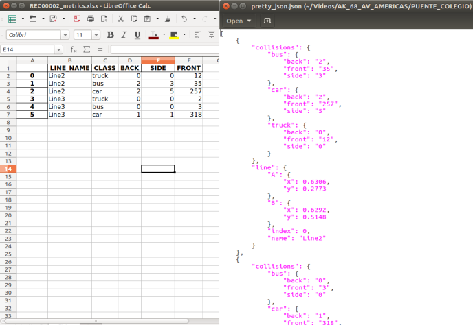

# Problema
Hemos identificado en el conteo de vehículos de forma manual 3 pasos principales:
1. Planeación 
1. Toma de información
1. Análisis
1. Resultados

## Aspectos por mejorar del método manual
1. Complejidad de la logística: El método actual de conteo vehicular utiliza varias personas que son difíciles de gestionar, desde la planeación, lo administrativo, legal hasta el pago.
2. Error humano: Las personas que hacen conteo introducen un margen de error.
3. Tiempo: La toma y consolidación tardan tiempo.
4. Costo: Múltiples personas para una intersección es costoso.

Lo anterior concluye en un problema de calidad

# Wanda como solución
Es un servicio de conteo vehicular automatizado  que usa inteligencia artificial para aumentar la calidad del conteo y facilitar la logística en los puntos de toma de información.

## Proceso

### Planeación: AugenCore es un sistema que integra el proceso de punta a punta, desde la planeación y la toma hasta la entrega de resultados al cliente. (En desarrollo)

### Captura: 
50 horas continuas de video
Almacenamiento eficiente
Autonomía
Montaje robusto
Confiabilidad

### Procesamiento:

Detección y conteo de los tipos de vehículos:
Autos
Buses
Camiones
Motos (En pruebas)
Personas (No simultaneo)
Bicicletas (En construcción)

### Consolidación:
- Conteos por tiempos parciales
- Verificación de calidad
- Entrega de resultados personalizados (Formato y Contenido)

# Camino Recorrido
## Inicio
Conceptualización
Open Data Cam ( https://opendatacam.moovellab.com):
Nvidia Jetson Tx2 (8 fps)
C Lang + Javascript + Darknet Framework
Yolov3
Baterías de 12v

Detección 
+ Precisión
- Latencia (12 fps, Nvidia Jetson Tx2)
+ Datos
Yolov3 / SSD / FasterR-CNN / R-FCN / RetinaNet / FPN
Tensorflow + TensorRT
Seguimiento
Direccionalidad

Servicio en la nube
AWS (actual)
Azure (desplegable)
Google Cloud (desplegable)
Datacenter Local (desplegable)
Escalabilidad
Re-Procesamiento
Interfaz Gráfica
Lineas de Conteo, Flujos de intersección
- Latencia (38 fps, Nvidia GeForce 1060)
Procesamiento por Lotes
Desplegable IoT

## Metas alcanzadas

Sistema de gestión de información en movilidad
Logistica probada.
Eficiencia en autonomía de toma.
Aumento de calidad de información
Bibliotecas ajustadas a las condiciones locales
Modelo de negocio

## Requerimientos Ideales
Integración con la planeación y la entrega de resultados
Auditoría y seguridad

# Quienes somos

Augen es una empresa que busca innovar en la generación de conocimiento a partir del análisis de video, enfocándose inicialmente en el nicho de transporte y movilidad.

# Cifras de uso
“Sed ut perspiciatis, unde omnis iste natus error sit voluptatem accusantium doloremque laudantium, totam rem aperiam eaque ipsa, quae ab illo inventore veritatis et quasi architecto beatae vitae dicta sunt, explicabo. Nemo enim ipsam voluptatem, quia voluptas sit, aspernatur aut odit aut fugit, sed quia consequuntur magni dolores eos, qui ratione voluptatem sequi nesciunt, neque porro quisquam est, qui dolorem ipsum, quia dolor sit amet consectetur adipisci[ng] velit, sed quia non numquam [do] eius modi tempora inci[di]dunt, ut labore et dolore magnam aliquam quaerat voluptatem. Ut enim ad minima veniam, quis nostrum exercitationem ullam corporis suscipit laboriosam, nisi ut aliquid ex ea commodi consequatur? Quis autem vel eum iure reprehenderit, qui in ea voluptate velit esse, quam nihil molestiae consequatur, vel illum, qui dolorem eum fugiat, quo voluptas nulla pariatur?”
# Wanda funcionando

# Planes o Servcios
Aplicación de planeación
Toma de videos
Procesamiento en la nube de videos
Análisis de información

# Características especiales de Wanda
“Sed ut perspiciatis, unde omnis iste natus error sit voluptatem accusantium doloremque laudantium, totam rem aperiam eaque ipsa, quae ab illo inventore veritatis et quasi architecto beatae vitae dicta sunt, explicabo. Nemo enim ipsam voluptatem, quia voluptas sit, aspernatur aut odit aut fugit, sed quia consequuntur magni dolores eos, qui ratione voluptatem sequi nesciunt, neque porro quisquam est, qui dolorem ipsum, quia dolor sit amet consectetur adipisci[ng] velit, sed quia non numquam [do] eius modi tempora inci[di]dunt, ut labore et dolore magnam aliquam quaerat voluptatem. Ut enim ad minima veniam, quis nostrum exercitationem ullam corporis suscipit laboriosam, nisi ut aliquid ex ea commodi consequatur? Quis autem vel eum iure reprehenderit, qui in ea voluptate velit esse, quam nihil molestiae consequatur, vel illum, qui dolorem eum fugiat, quo voluptas nulla pariatur?”
